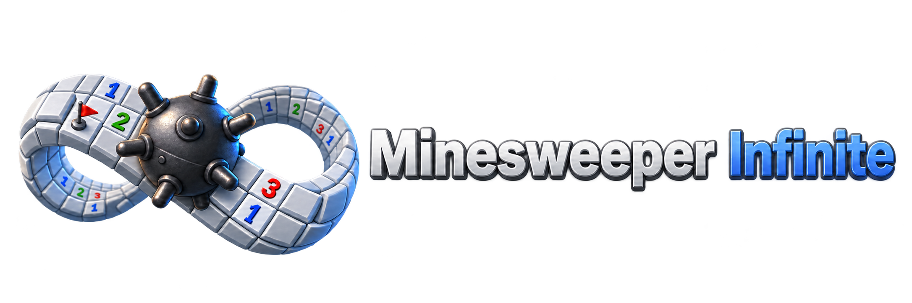

<p align="center">
  
</p>

<p align="center">
  <a href="../README.md"> Français</a>
  /
  <a href="README.en.md"> English</a>
</p>

# Minesweeper Infinite

A faithful browser recreation of the classic Minesweeper, inspired by the Windows XP interface and built with strict TypeScript and Vite.

Minesweeper Infinite runs directly in a modern browser with no installation. It preserves the familiar rules and pixel-art presentation while adding a responsive grid, a fit-to-window mode, and several display zoom levels.

The visual presentation is based on [ShizukuIchi/minesweeper](https://github.com/ShizukuIchi/minesweeper).

## Features

- Complete game engine with mine placement, recursive opening, flags, chord opening, and win/loss detection.
- Pixel-accurate interface inspired by Windows XP, using the original-style sprites, counters, faces, and menu.
- Three classic difficulties: `Beginner`, `Intermediate`, and `Expert`.
- `Fit to window` mode that adapts the grid dimensions and mine count to the available space.
- `1x`, `1.5x`, and `2x` display zoom, supported by every difficulty and by `Fit to window`.
- Mouse and touch controls, including right click and touch long press for flags.
- Timer, remaining-mine counter, sound effects, and visual game states.
- Responsive centered layout with sharp pixel-art rendering.
- Basic offline support through a service worker.

## Play Online

The current version is published on GitHub Pages:

[Play Minesweeper Infinite](https://karlos-fr.github.io/minesweeper-infinite/)

## Usage

1. Open the game in a browser.
2. Choose a difficulty from the `Game` menu or select `Fit to window`.
3. Open a cell to start the timer and generate the minefield.

The `Game` menu provides:

- `New` (`F2`): restarts the active game mode;
- `Beginner`, `Intermediate`, and `Expert`: selects a classic difficulty;
- `Fit to window`: fills the available space with a dynamically sized grid;
- `Zoom 1x`, `Zoom 1.5x`, and `Zoom 2x`: changes the size of the board and its controls.

Controls:

- left click or tap: open a cell;
- right click or touch long press: place or cycle a marker;
- press both mouse buttons on an open numbered cell: open its neighbors when the flag count matches;
- click the face: start a new game.

Once a game is won or lost, grid input remains disabled until a new game starts.

## Difficulties

| Difficulty | Grid | Mines |
| --- | ---: | ---: |
| Beginner | 9 × 9 | 10 |
| Intermediate | 16 × 16 | 40 |
| Expert | 16 × 30 | 99 |

`Fit to window` computes the number of rows and columns from the viewport and selected zoom. Its mine count preserves the density of the difficulty that was active when the mode was selected.

## Architecture

```text
src/
├── app/            # Application lifecycle, menu, layout, and orchestration
├── canvas/         # Pointer input, geometry, and board rendering
├── core/           # Shared configuration and game types
│   └── engine/     # Reducer, store, grid generation, opening, and validation
└── ui/
    ├── assets/     # Pixel-art sprites and sound effects
    └── styles/     # Global, menu, canvas, and board styles
public/
└── sw.js           # Service worker
```

The game rules remain independent from browser APIs. The application layer connects the game store to the input, layout, menu, audio, and hybrid Canvas/DOM renderer.

## Requirements

- Node.js 20 or later recommended;
- npm;
- a modern browser.

## Local Development

```bash
npm install
npm run start
```

Vite serves the application at `http://localhost:5173/minesweeper-infinite/` by default.

## Checks and Build

```bash
npm run typecheck
npm run build
npm run preview
```

The production application is generated in `dist/`.

## Technical Choices

- Strict TypeScript and native browser APIs.
- Vite for development and production builds.
- No UI framework or runtime application dependency.
- Game engine isolated from rendering and browser interactions.
- Hybrid Canvas/DOM rendering for precise input mapping and faithful visuals.
- Original-style raster sprites preserved with pixelated scaling.
